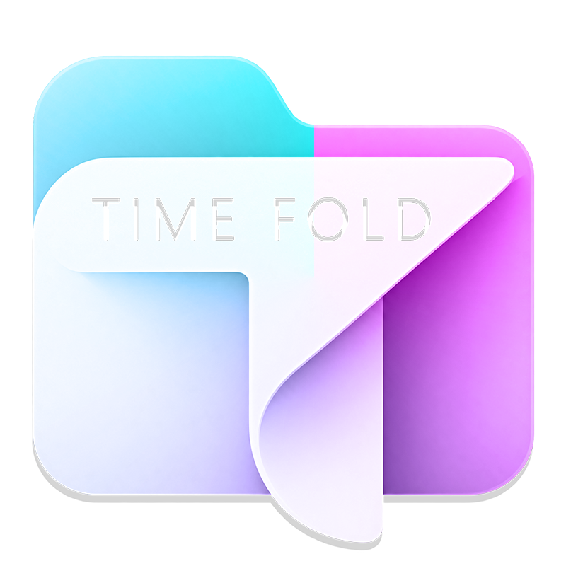

<p align="center">
  
</p>

<h1 align="center">VeFoldery</h1>

<p align="center">
  <strong>Fast, non-destructive file and folder organizer for macOS, Linux and Windows that turns messy directories into clean date-based timelines, file-type categories, or structured extension-based folders.</strong>
</p>

> [!IMPORTANT]
> **VeFoldery is a derivative of [VeFoldery](https://github.com/chandrath/VeFoldery-File-Folder-Organizer)** by [@chandrath](https://github.com/chandrath) — a Windows Forms organizer for Windows. VeFoldery started as a fork and was rewritten as a cross-platform Avalonia application. All credit for the original concept, the organizer core, and the category/date system goes to the original author. This repository continues that work under the same **GPLv3** license, extending it to macOS, Linux and Windows.

<p align="center">
  
  
  
  
  
</p>

---

## What VeFoldery Does

VeFoldery is a cross-platform file and folder organizer for people who have too many files in places like **Downloads**, **Screenshots**, **Photos**, or the **Desktop**.

Instead of manually creating folders and moving files one by one, VeFoldery scans a selected folder, shows you the planned destinations, and then organizes the files and supported folders into the structure you choose.

Imagine your **Downloads** folder has **10,000+ random files**:

```text
Downloads/
├── photo123.jpg
├── invoice.pdf
├── vacation.mp4
├── project.zip
├── screenshot.png
├── report.docx
├── presentation.pptx
├── song.mp3
├── model.blend
├── drawing.dwg
├── vlc-setup.exe
├── script.py
└── ... 10,000+ other files
```

With VeFoldery, that same folder can be organized into a predictable structure instead of one large mixed list.

### Organize by file category

VeFoldery can group supported files into categories such as **Images, PDF Files, Document Files, Office Files, Video Files, Audio Files, 3D Files, CAD Files, Code Files, App Installers, and Zip & Archives**.

```text
Downloads/
├── Images/
│   ├── photo123.jpg
│   └── screenshot.png
│
├── PDF Files/
│   └── invoice.pdf
│
├── Document Files/
│   └── report.docx
│
├── Office Files/
│   └── presentation.pptx
│
├── Video Files/
│   └── vacation.mp4
│
├── Audio Files/
│   └── song.mp3
│
├── 3D Files/
│   └── model.blend
│
├── CAD Files/
│   └── drawing.dwg
│
├── Code Files/
│   └── script.py
│
├── App Installers/
│   └── vlc-setup.exe
│
└── Zip & Archives/
    └── project.zip
```

### Organize by date

VeFoldery can also organize files and folders into date-based folders. You can choose from 29 date formats, from months to quarters to year-only:

```text
Month    → 2026-09
Day      → 2026-09-23
Quarter  → 2026-Q3
Year     → 2026
```

### Combine date and category

When you want both chronological organization and file-type grouping, VeFoldery supports two-level hybrid structures.

**Category / Date**

```text
Downloads/
├── Images/
│   ├── 2026-08/
│   └── 2026-09/
│
└── Video Files/
    ├── 2026-08/
    └── 2026-09/
```

**Date / Category**

```text
Downloads/
├── 2026-08/
│   ├── Images/
│   ├── PDF Files/
│   └── Video Files/
│
└── 2026-09/
    ├── Images/
    ├── PDF Files/
    └── Video Files/
```

### Organize by file extension

For a more precise structure, VeFoldery can organize files by their actual file extension.

```text
Downloads/
├── ZIP/
│   ├── project.zip
│   └── backup.zip
│
├── PDF/
│   ├── invoice.pdf
│   └── manual.pdf
│
└── JPG/
    ├── photo123.jpg
    └── IMG_2847.jpg
```

### One tool, multiple ways to organize

| Organization method | What it does |
| --- | --- |
| **Category** | Groups supported files into categories such as Images, PDF Files, Document Files, Office Files, Video Files, Audio Files, 3D Files, CAD Files, Code Files, App Installers, and Zip & Archives |
| **Date** | Groups files and folders by Month, Day, Quarter, or Year (29 formats) |
| **Category / Date** | Uses category as the first folder level and date as the second |
| **Date / Category** | Uses date as the first folder level and category as the second |
| **File Extension** | Groups files by their actual extension such as PDF, JPG, DOCX, ZIP, PSD, or PY |

VeFoldery is not just a visual sorter. It **actually relocates files and supported folders** into the destination structure generated by your selected organization method.

---

## Why VeFoldery Is Useful

A folder with thousands of mixed files can make everyday file management harder:

- **Digital clutter:** Downloads, receipts, screenshots, media, archives, and project files accumulate in one place.
- **Manual sorting takes time:** Creating folders and moving files individually is repetitive and error-prone.
- **Harder to find files:** When unrelated file types share the same directory, locating the right item becomes slower.
- **Large folders need structure:** A predictable hierarchy makes large collections easier to browse and maintain.

VeFoldery is designed to reduce that manual work while keeping the organization process visible and reviewable.

---

## How VeFoldery Works

VeFoldery uses a **preview-first workflow** so you can see what it plans to do before organization begins.

1. **Select Source:** Choose, drag and drop, or launch with the folder you want to organize.
2. **Review Preview:** VeFoldery scans the directory and shows the planned destinations in the live preview grid.
3. **Start Organizing:** Confirm the run — potential conflicts are detected and you decide whether to auto-rename or skip colliding items.
4. **Review the Result:** Open the output folder and use the generated CSV audit log to review the organization run.
5. **Undo:** Made a mistake? Every run's CSV log powers one-click Undo that restores files to their original locations.

---

## ✨ Key Features

- **⚡ Smart Date Sorting:** Organize files and folders by **Month**, **Day**, **Quarter**, or **Year** — 29 folder formats.
- **🗂️ Smart Categories:** Organize supported file types into **Images, PDF Files, Document Files, Office Files, Video Files, Audio Files, 3D Files, CAD Files, Code Files, App Installers, and Zip & Archives**.
- **🧩 Hybrid Organization:** Combine date and category using **Category / Date** or **Date / Category** nesting.
- **🔤 File Extension Mode:** Organize files by their raw file extension for a more precise structure.
- **🛡️ Non-Destructive Organization:** VeFoldery does not delete, alter, or compress your original files. It relocates items into the organized structure you choose.
- **⚠️ Conflict Detection:** Before moving anything, VeFoldery detects folder collisions and duplicate names, and lets you auto-rename or skip them.
- **↩️ One-Click Undo:** Every run writes a CSV audit log; Undo restores everything to its original place.
- **🔍 Full Interactive Preview:** Review files and their exact destinations in the live preview before moving anything.
- **🎨 Dark & Light Themes:** Clean, minimalist interface with an instant theme switcher.
- **🖱️ Drag & Drop:** Drop a folder anywhere on the window to start organizing it.
- **💻 Self-Contained:** Single binary per platform — no .NET runtime installation required.

---

## 🚀 Getting Started

### Option 1: Download (Recommended)

1. Go to the [Releases](https://github.com/verosoft/VeFoldery-File-Folder-Organizer/releases) page.
2. Choose the download for your platform:

   | Platform | File | Notes |
   | --- | --- | --- |
   | macOS (Apple Silicon) | `VeFoldery-vX.Y.Z-macos-osx-arm64.zip` | Extract and open `VeFoldery.app` |
   | macOS (Intel) | `VeFoldery-vX.Y.Z-macos-osx-x64.zip` | Extract and open `VeFoldery.app` |
   | Linux x64 | `VeFoldery-vX.Y.Z-linux-linux-x64.tar.gz` | Extract and run `./VeFoldery` |
   | Linux ARM64 | `VeFoldery-vX.Y.Z-linux-linux-arm64.tar.gz` | Extract and run `./VeFoldery` |
   | Windows x64 | `VeFoldery-vX.Y.Z-win-x64.zip` | Extract and double-click `VeFoldery.exe` |

   Every build is **self-contained**: no .NET installation needed.

   > **macOS note:** the app is not notarized. On first launch, right-click `VeFoldery.app` → **Open** to bypass Gatekeeper.

### Option 2: Build from Source

#### Prerequisites

- macOS, Linux, or Windows
- [.NET 10 SDK](https://dotnet.microsoft.com/download/dotnet/10.0)

#### Clone & Run

```bash
git clone https://github.com/verosoft/VeFoldery-File-Folder-Organizer.git
cd VeFoldery-File-Folder-Organizer

# Run in Development Mode
dotnet run --project app
```

#### Build a Self-Contained Single-File Executable

```bash
# macOS (Apple Silicon), also: osx-x64, linux-x64, linux-arm64, win-x64
dotnet publish app/VeFoldery.Avalonia.csproj -c Release -r osx-arm64 --self-contained -o ./publish
```

#### macOS App Bundle

```bash
./scripts/package-macos.sh ./publish ./dist
# → dist/VeFoldery.app
```

---

## 🛠️ Tech Stack

- **Runtime & Framework:** .NET 10
- **Language:** C# 13
- **UI Framework:** Avalonia 12 (MVVM with CommunityToolkit.Mvvm)
- **Dependencies:** Avalonia + CommunityToolkit.Mvvm only
- **CI/CD:** GitHub Actions builds 5 platform bundles on every version tag

---

## 📄 License

This project is open source and licensed under the [GNU General Public License v3.0 (GPLv3)](LICENSE).

